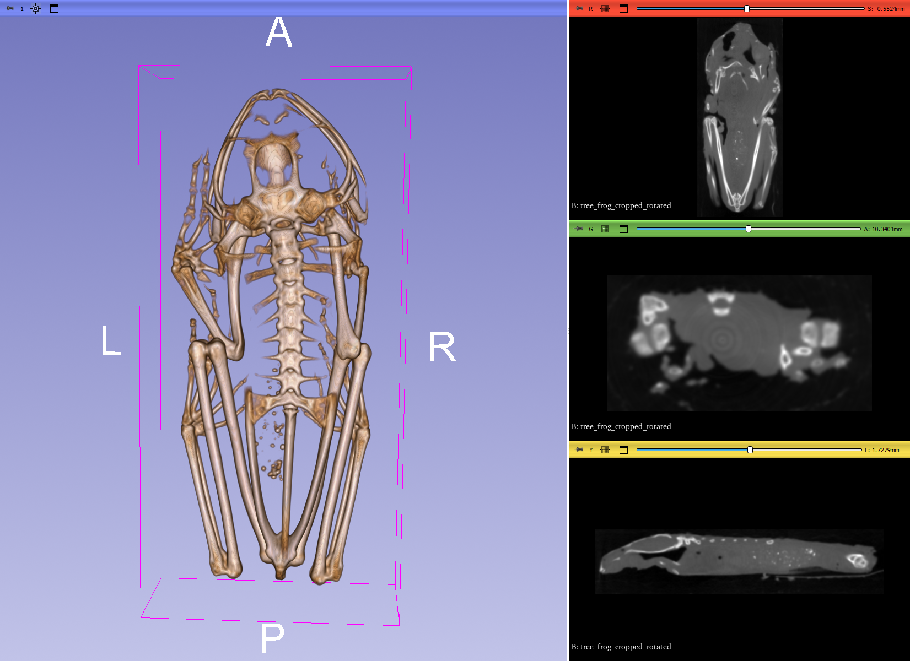

## MorphoDepot Repository
Repository for segmentation of a specimen scan.  See [this JSON file](MorphoDepotAccession.json) for specimen details.
* Species: Agalychnis callidryas
* Modality: Micro CT (or synchrotron)
* Contrast: No
* Dimensions: (165, 379, 85)
* Spacing (mm): (0.1439999938, 0.143999992409867, 0.1439999938)

## Screenshots

_Screenshot_
